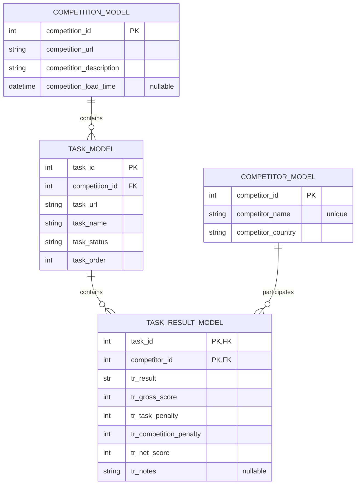

<p align="center">
    <a href="#">
        
    </a>
</p>

<h2 align="center" style="border-bottom: none;">This is a FASTAPI REST API to obtain and analyse HAB results from WMF</h2>

<p align="center">
    <a href="https://iayala.github.io/wmf_scraper/">
        
    </a>
    <a href="#">
        
    </a>
    <a href="https://github.com/IAyala/wmf_scraper/actions/workflows/publish_coverage.yml">
        
    </a>
</p>

## Developing
### Prerequisites

* Docker - For windows go to [Docker Desktop for Windows](https://docs.docker.com/docker-for-windows/install/) and download and install the latest version of Docker for Windows. Other platforms go to [Docker Documentation](https://docs.docker.com/)
* WSL 2 - For better performance, we recommend using WSL 2

### Cloning

* Clone the repository **in WSL**
```
git clone --depth=1 https://github.com/IAyala/wmf_scraper.git
```

Usage
-----

### Running The Environment

The project includes an integrated environment that includes all you need to develop `wmf_scraper`.

Run the following commands in the root folder:

```bash
$ ./environment/build_image.sh
$ ./environment/start_image_dev.sh
```

This will run the development environment for you.

Once the image has been built and started, goto [http://localhost:8888](http://localhost:8888)

### Help

Run the following command in the dev environment to get some help:

```bash
$ help
```

## Documentation

### Running the API

All the results are retrieved from `watchmefly` website through web scraping techniques, and stored in `sqlite` database to be queried afterwards. The default port where the API runs is `8000` by default, and swagger generates automatic doc page for you, so just execute:

```bash
$ python src/main.py
```

And then go to: [http://localhost:8000/docs](http://localhost:8000/docs)

### Database Entity Relationship Diagram


